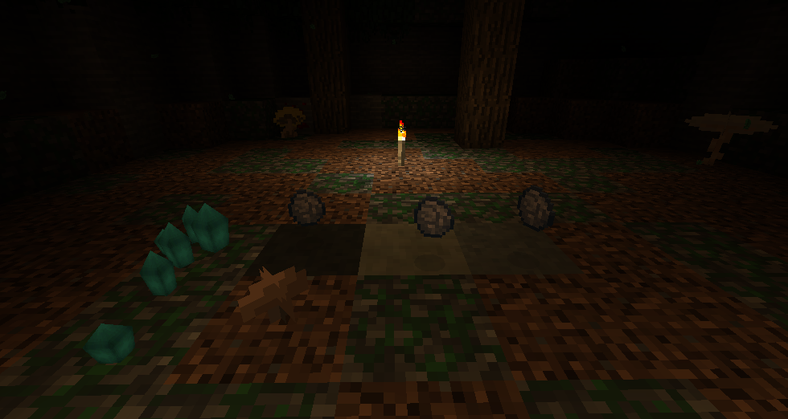

# Geode stone support example

This is an example on how to configure from which blocks geodes can be looted. The example does the following:
 * Registers 3 new blocks from undergroundbiomes as geode variants
 * Updates the blockstate to properly render textures for the new variants

## File breakdown:
The name of the resource pack `tetra-content` is not important and another name else can be used instead.
* `config/tetra/geode/variants.json`: Registers 3 new geode variants
* `resourcepacks/tetra-content/assets/tetra/blockstates/block_geode.json`: Adds textures for the 3 new variants of the geode block