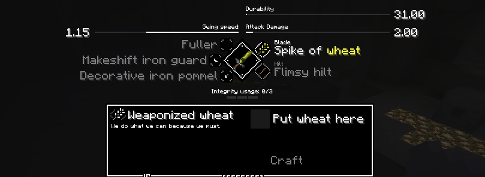

# Module and schema configuration example

This is an example on how to configure modules and schemas, the example does the following:
 * Replaces the basic blade variants with a "spike of wheat" and a paper blade
 * Replaces all outcomes for the basic blade schema so that paper blade is the only available outcome
 * Adds a new schema called "Weaponized wheat" (using the basic blade schema file), which is used to craft the "spike of wheat" blade variant
 * Adds localization entries for all new content
 * Adds a new glyph (the icon representing the module in the crafting UI)
 * Adds item textures for the two blades

## File breakdown:
The name of the resource pack `tetra-content` not important and another name else can be used instead.
* `config/tetra/modules/sword/basic_blade.json`: Replaces the basic blade module variants with the wheat paper variants
* `config/tetra/schemas/sword/basic_blade.json`: Replaces all basic blade schema outcomes with the paper blade, also adds the new "weaponized wheat" schema
* `resourcepacks/tetra-content/assets/tetra/textures/gui/my-glyphs.png`: New glyph for the "spike of wheat" module
* `resourcepacks/tetra-content/assets/tetra/textures/items/basic_blade/paper.png`: New texture for the paper blade
* `resourcepacks/tetra-content/assets/tetra/textures/items/simple_wheat/wheat.png`: New texture for the "spike of wheat" module