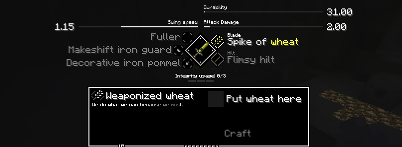

# Tetra configuration example

This is an example on how to configure tetra, the example does the following:
 * Replaces the basic blade variants with a wheat blade and a paper blade
 * Replaces the basic blade schema with a new schema which can only craft the paper blade
 * Adds a new schema (using the basic blade schema file) which is used to craft the wheat blade
 * Adds localization entries for all new content
 * Adds a new glyph
 * Adds item textures for the two blades
